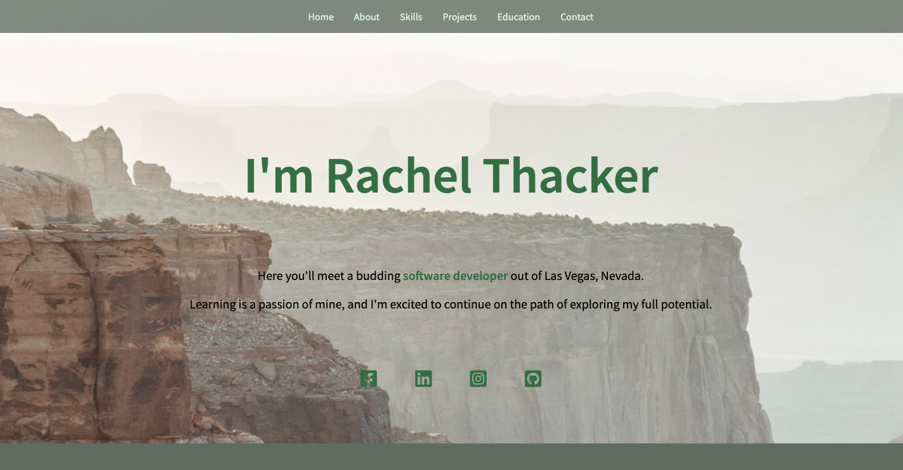

# My Portfolio
> This is a website I made compiling all my work and recent projects.

## Table of contents
* [General info](#general-info)
* [Screenshots](#screenshots)
* [Features](#features)
* [Status](#status)
* [Contact](#contact)

## General info
I built this website using HTML5, CSS3, and Javascript. My intention was to gain experience in learning the specifics within each of the previously mentioned languages. I wanted to create a place to keep all my awesome projects in one place.

## Screenshots

## Code Examples
Examples of usage:
`.social-media a:hover {
    transition: ease-in-out 20ms;
    opacity: 0.7;
    color: #416B46;
}`

## Features
List of features ready.
* Interactive drop-down menu
* Responsive

To-do list:
* Toggle Light/Dark Mode
* Add more projects

## Status
Project is: _in progress_, still working to add more projects as I am currently learning new technologies.

## Contact
Created by [@Rachel Thacker](rar227@gmail.com) - feel free to contact me!